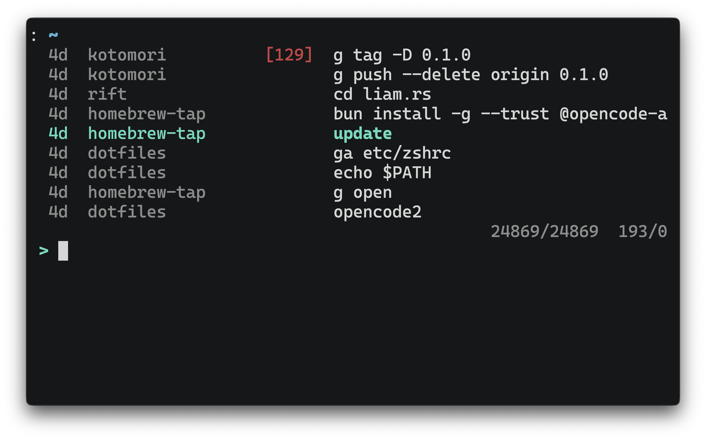

## honu


[](https://github.com/terror/honu/releases/latest)
[](https://crates.io/crates/honu)
[](https://github.com/terror/honu/actions/workflows/ci.yaml)
[](https://codecov.io/gh/terror/honu)
[](https://github.com/terror/honu/releases)

`honu` records, imports, and searches your shell history with SQLite.



If you need help with `honu` please feel free to open an issue. Feature requests
and bug reports are always welcome!

## Installation

`honu` should run on any system, including Linux, MacOS, and Windows.

The easiest way to install it is by using
[cargo](https://doc.rust-lang.org/cargo/index.html), the Rust package manager:

```bash
cargo install honu
```

Otherwise, see below for the complete package list:

#### Cross-platform

<table>
  <thead>
    <tr>
      <th>Package Manager</th>
      <th>Package</th>
      <th>Command</th>
    </tr>
  </thead>
  <tbody>
    <tr>
      <td><a href=https://www.rust-lang.org>Cargo</a></td>
      <td><a href=https://crates.io/crates/honu>honu</a></td>
      <td><code>cargo install honu</code></td>
    </tr>
    <tr>
      <td><a href=https://brew.sh>Homebrew</a></td>
      <td><a href=https://github.com/terror/homebrew-tap>terror/tap/honu</a></td>
      <td><code>brew install terror/tap/honu</code></td>
    </tr>
  </tbody>
</table>

## Configuration

`honu` reads its configuration from `$XDG_CONFIG_HOME/honu/config.toml`, or
`~/.config/honu/config.toml` when `XDG_CONFIG_HOME` is unset. On Windows, it
uses `%APPDATA%\honu\config\config.toml`:

```toml
[import]
shell = "zsh"
```

The configured import shell may be `bash`, `fish`, or `zsh`. An explicit shell
passed to `honu import` takes precedence over this setting.

### Pre-built binaries

Pre-built binaries for Linux, MacOS, and Windows can be found on
[the releases page](https://github.com/terror/honu/releases).

## Prior Art

This project was inspired by tools like
[atuin](https://github.com/atuinsh/atuin) and [stinkpot](https://tangled.org/oppi.li/stinkpot).
